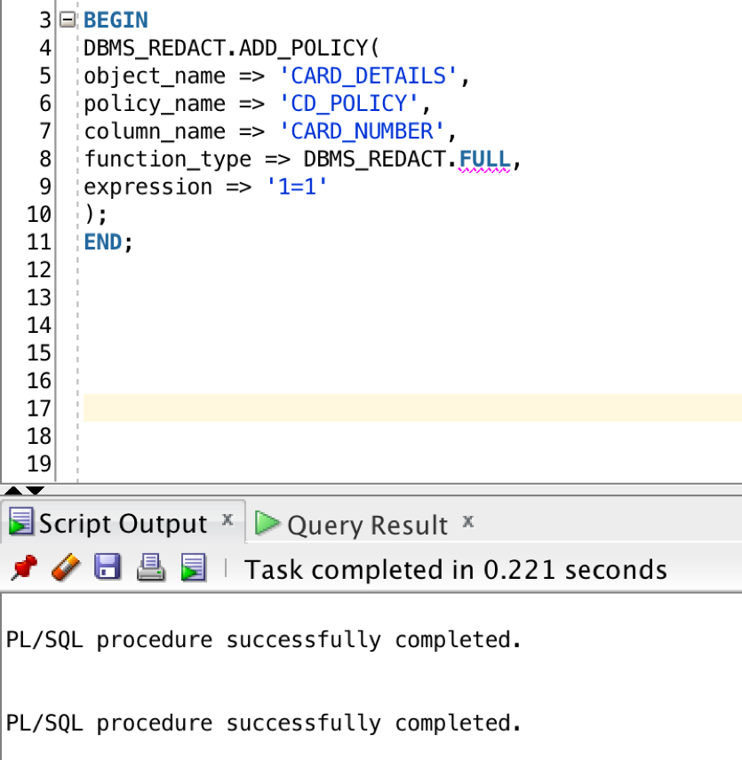
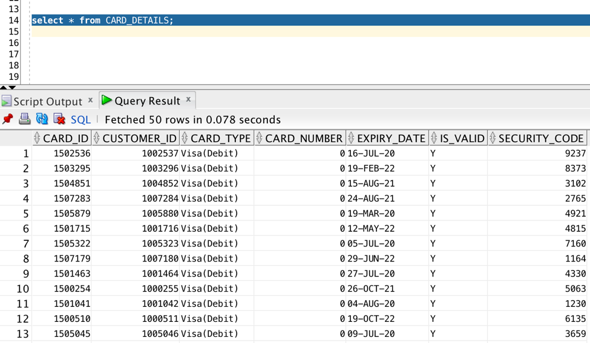

# Redaction

Redaction allows for the masking of sensitive data from the end-user layer. Until now if you wanted to mask the data on real time you needed to do it on the application layer or to use either custom made views or Virtual Private Database, all these solutions lacking functionalities that Data Redaction finally brings. With Data Redaction is now possible to easily totally or partially mask the data, randomize the data and set the masking conditions

  

## Objectives

- The objective of this lab is to mask the CREDIT_NUMBER column from the CREDIT_DETAILS table that we will upload in our autonomous database.

## Required Artifacts

- The following lab requires an Oracle Public Cloud account with Autonomous Data Warehouse Cloud Service.

- You have to grant DBMS_REDACT access to the user. Type the following SQL statement in SQL Workbench while you are still connected to database as admin:
    
    **GRANT EXECUTE ON dbms_redact TO user** 
    
- Download wallet from Autonomous Database.
    
### **Step 1**: Create CREDIT_DETAILS table in Autonomous Database.

- You need to have a connection to database through SQL Developer.
    1.	Connection Name: give any name
    2.	Username: enter your username. Here, my user is soe.
    3.	Password: enter database password
    4.	Connection Type: Cloud PDB
    5.	Configuration File: Path to your autonomoud database wallet
    6.	Keystore Password: Password entered while downloading wallet. 

  

- Click on Test, if it shows success, click on save and then click on connect. 

- Download the csv file. [CREDIT_DETAILS.csv](card_details.csv)

- Upload data from the following csv file in your autonomous database.

    1. Right click on **table** and then **import data**.

        
        
    2. Leave the source as **Local File**, click on Browse and select the downloaded csv file.
    
        
        
    3. Click on next till you reach the review page and click on finish. Table is created and the data is loaded.
    
    

### **Step 2**: CREATE REDACTION ON CARD_NUMBER

- We will do redaction on the card_number column of the table CARD_DETAILS. 
  Let’s look at the details of the table. 

  Copy paste the following command:

  Select * from CARD_DETAILS;

  

- You can see the CARD_NUMBER column in the CARD_DETAILS. 

- Creating a new redaction policy is done using the ADD_POLICY procedure in
the DBMS_REDACT package. A policy is made up of several distinct sections.
    
    - Identify the object : The OBJECT_SCHEMA, OBJECT_NAME and COLUMN_NAME parameters identify the column to be redacted.
    
    - Give it a name : The POLICY_NAME parameter assigns a name to the policy.
    
    - What should happen? : The FUNCTION_TYPE parameter determines the type of redaction that should take place. The allowable values are listed here. Depending on the type of redaction selected, you may be required to specify the FUNCTION_PARAMETERS or various REGEXP_* parameters.
    
    - When should it happen? : The EXPRESSION parameter determines when the redaction should take place. For example, an expression of "1=1" means the redaction will always take place. Alternatively, situational expressions can be defined using the SYS_CONTEXT function.

- Copy paste the following SQL statement :

    **BEGIN
      DBMS_REDACT.ADD_POLICY(
      object_name => 'CARD_DETAILS',
      policy_name => 'CD_POLICY',
      column_name => 'CARD_NUMBER',
      function_type => DBMS_REDACT.FULL,
      expression => '1=1'
      );
      END;**

  

- Let’s view the CARD_DETAILS table again. 

  
  
  We can see the CARD_NUMBER column is now redacted to the number "0". 

